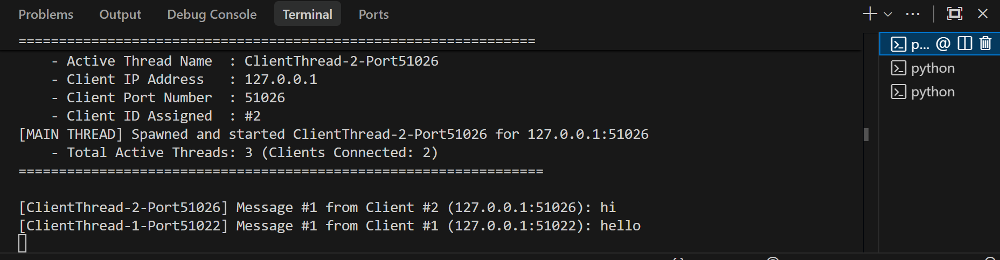
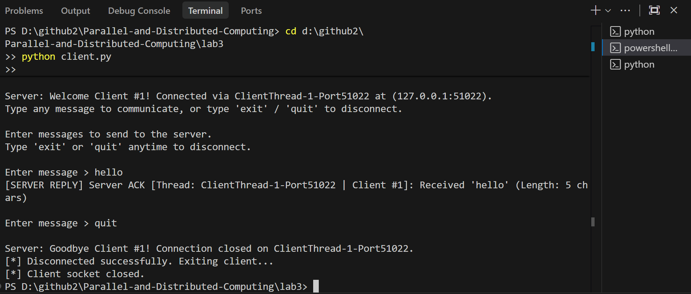
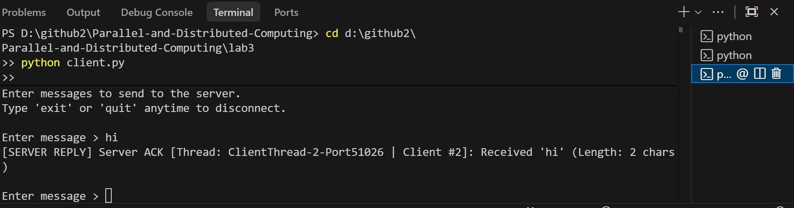

# Course: Parallel and Distributed Computing (CSC-334)
## Lab 03: Socket Programming with Multi-Threading

**Student Name:** Muhammad Ahmad Mujtaba  
**Registration No:** FA23-BSE-041  
**Class & Section:** BSE 7A (Software Engineering)  
**Department:** Computer Science / Software Engineering  

---

## 📋 Lab 03 Overview & Objectives

In this lab, we build a **Multi-Threaded TCP Server and Client architecture** in Python using the standard library `socket` and `threading` modules.

Unlike single-threaded servers that block on I/O and can only serve one client sequentially, this multi-threaded server handles **multiple clients simultaneously and concurrently** by delegating each newly accepted connection to an independent worker thread.

---

## 🚀 Key Requirements & Implementation

| Requirement | Implementation Detail | Status |
| :--- | :--- | :---: |
| **Multi-Threaded Server** | Utilizes Python's `threading` module to accept and handle multiple clients concurrently without blocking. | ✅ Done |
| **New Thread per Client** | Main listener thread invokes `threading.Thread(target=handle_client, args=(...), name=...)` upon every `accept()`. | ✅ Done |
| **Terminal Output** | Displays **Active Thread Name**, **Client IP**, **Port Number**, and **Active Thread Count** in real time. | ✅ Done |
| **Thread Synchronization** | Employs `threading.Lock()` with explicit `.acquire()` and `.release()` calls to prevent race conditions on terminal printing (`safe_print`) and shared state (`connected_clients`, `client_counter`). | ✅ Done |
| **Continuous Client Chat** | Interactive `while True` loop allows continuous message exchange between client and server until the user inputs `'exit'`, `'quit'`, or `'bye'`. | ✅ Done |
| **Documentation & Concepts** | Complete conceptual guide (`concept.txt`) and line-by-line working explanation (`working.txt`) in Roman Urdu & English. | ✅ Done |
| **Terminal Screenshots** | Server and simultaneous clients output screenshots added to repository. | ✅ Done |

---

## 📂 Directory Structure

```text
lab3/
├── server.py        # Multi-Threaded TCP Server script
├── client.py        # Continuous interactive TCP Client script
├── concept.txt      # Concise conceptual explanation (Easy Roman Urdu + English)
├── working.txt      # Full code working, line-by-line breakdown, and execution guide
├── ss/              # Output terminal screenshots
│   ├── server.PNG   # Multi-threaded server console output
│   ├── client1.PNG  # Client 1 interactive session output
│   └── client2.PNG  # Client 2 concurrent session output
└── README.md        # Lab documentation and GitHub submission guide
```

---

## 📸 Output Terminal Screenshots

### 1. Multi-Threaded Server Terminal Output
*Displays listener initialization, concurrent client connections, assigned thread names (`ClientThread-1-...`, `ClientThread-2-...`), client IP & Port, active threads count, and thread termination cleanup.*



---

### 2. Client 1 Terminal Output
*Shows Client 1 connecting, receiving server welcome banner with thread info, continuous message exchange, and graceful exit.*



---

### 3. Client 2 Terminal Output (Simultaneous Connection)
*Demonstrates Client 2 connecting and communicating concurrently with the server while Client 1 is active, without any head-of-line blocking.*



---

## 🛠️ How to Run

### Step 1: Start the Multi-Threaded Server
Open your first terminal and run:
```bash
python server.py
```
*The server will initialize on `127.0.0.1:8888` and await client connections.*

### Step 2: Start Client 1
Open a second terminal window and run:
```bash
python client.py
```
*Client 1 will connect, receive its unique Client ID and dedicated Thread Name, and enter the interactive messaging prompt.*

### Step 3: Start Client 2 (Simultaneous Execution)
Open a third terminal window and run:
```bash
python client.py
```
*Client 2 will connect concurrently on a separate worker thread. Both clients can now send messages simultaneously without blocking one another.*

### Step 4: Disconnecting
Type `exit`, `quit`, or `bye` in any client terminal. That client will shut down cleanly, and the server will update its active thread count while keeping all other clients running uninterrupted.

---

## 🔒 Thread Synchronization Details

- **`print_lock` (`threading.Lock`)**:
  Protects console printing from interleaving. Before printing, `print_lock.acquire()` is called, and upon output completion, `print_lock.release()` is executed inside a `finally` block.
- **`state_lock` (`threading.Lock`)**:
  Protects shared variables (`client_counter` and `connected_clients` dictionary). Ensures atomic registration and deregistration of active clients.

---

## 📝 Conceptual Guides
For detailed explanations, refer to:
- [`concept.txt`](file:///d:/github2/Parallel-and-Distributed-Computing/lab3/concept.txt): Theory of sockets, blocking I/O, threads, locks, mutex, and race conditions.
- [`working.txt`](file:///d:/github2/Parallel-and-Distributed-Computing/lab3/working.txt): Line-by-line walkthrough of the code, execution traces, and network state changes.