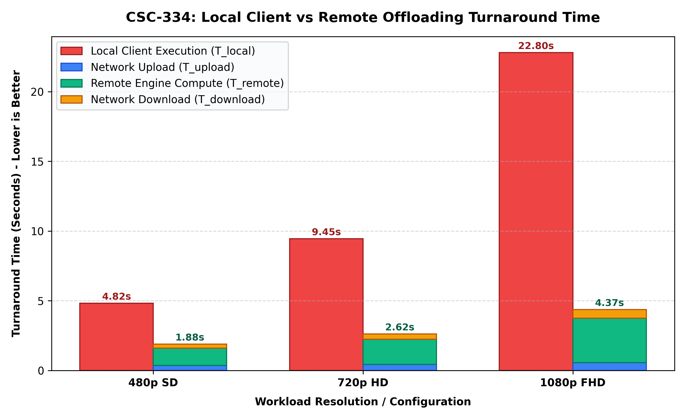
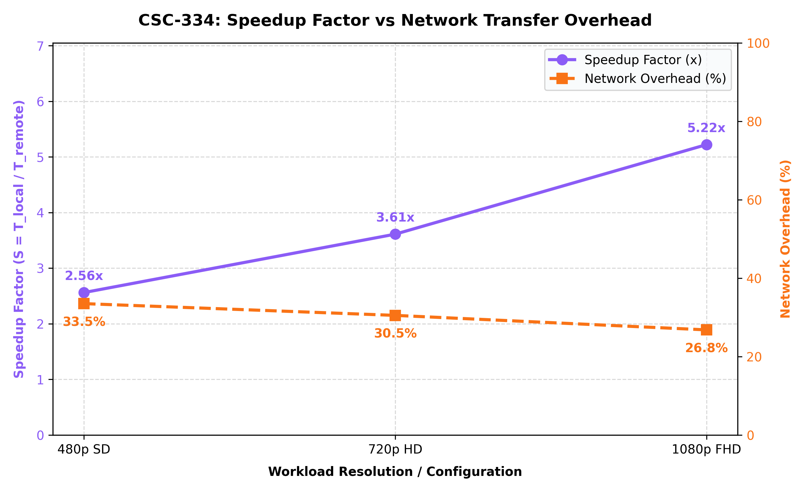
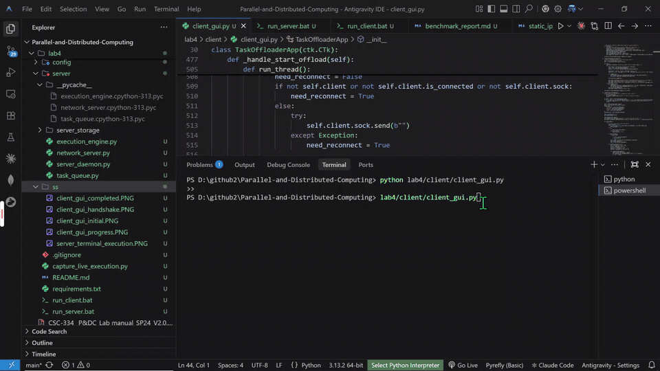
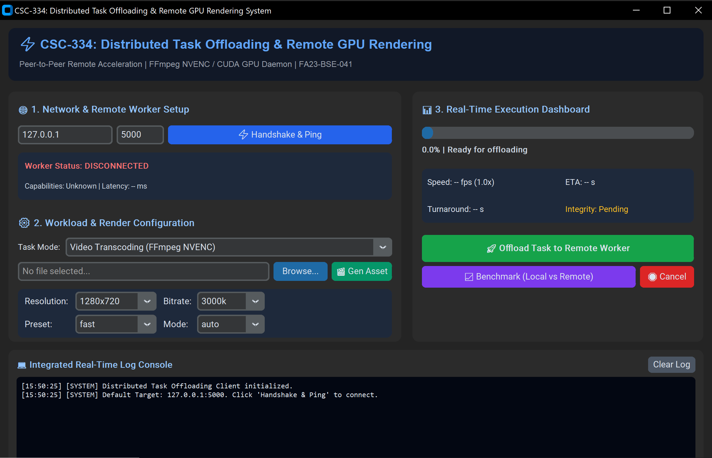
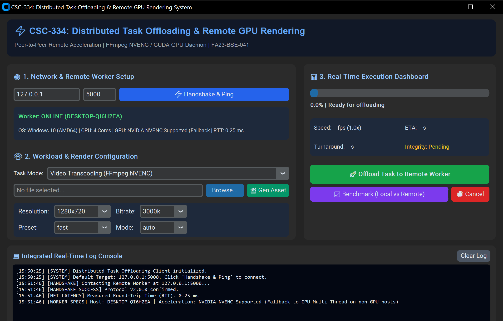
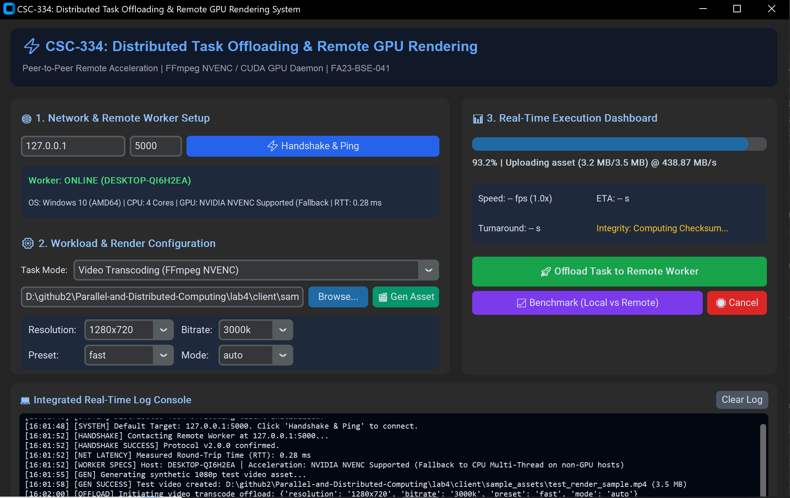
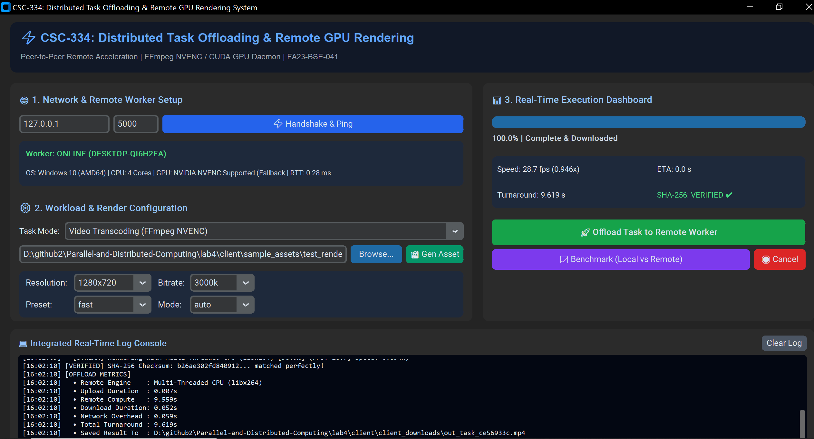
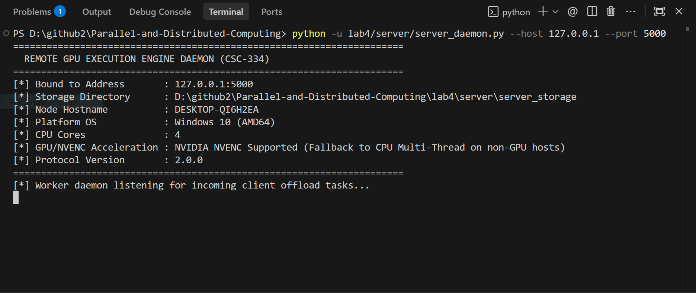

# 🚀 CSC-334: Custom Distributed Task Offloading & Remote GPU Rendering System (Lab 04)

<p align="center">
  
  
  
  
  
</p>

---

## 👨‍💻 Student Profile & Submission Credentials

| Field | Submission Details |
| :--- | :--- |
| **Student Full Name** | **Muhammad Ahmad Mujtaba** |
| **Registration Number** | **FA23-BSE-041** |
| **Degree Program** | Bachelor of Science in Software Engineering (BSE 7A) |
| **Course Code & Title** | **CSC-334: Parallel and Distributed Computing** |
| **Required Collaborator** | Invited `githubprojectmin@gmail.com` as collaborator |
| **Repository Visibility** | **PUBLIC** |

---

## 📑 Table of Contents
1. [Problem Statement & Motivation](#1-problem-statement--motivation)
2. [End-to-End System Architecture](#2-end-to-end-system-architecture)
3. [Task Breakdown & Implementation Evidence (100 Marks)](#3-detailed-task-breakdown--evidence-100-marks)
   - [Task 1: Networking & Handshake Protocol Setup (20 Marks)](#task-1-networking--handshake-protocol-setup--20-marks)
   - [Task 2: Remote GPU Execution Engine Daemon (25 Marks)](#task-2-remote-gpu-execution-engine-daemon--25-marks)
   - [Task 3: Client Desktop GUI Application (25 Marks)](#task-3-client-desktop-gui-application--25-marks)
   - [Task 4: Real-Time Progress Tracking & Network Robustness (15 Marks)](#task-4-real-time-progress-tracking--network-robustness--15-marks)
   - [Task 5: Performance Benchmarking & Analysis Report (15 Marks)](#task-5-performance-benchmarking--analysis-report--15-marks)
4. [Project Directory Layout](#4-project-directory-layout)
5. [Step-by-Step Execution Guide](#5-step-by-step-execution-guide)
6. [Static IP & Network Topology Setup Guide](#6-static-ip--network-topology-setup-guide)
7. [Experimental Results & Benchmark Visualizations](#7-experimental-results--benchmark-visualizations)

---

## 1. Problem Statement & Motivation

Modern computational tasks such as **high-resolution video transcoding (H.264/HEVC)** and **heavy tensor/matrix algebra** impose severe demands on hardware. Resource-constrained client laptops experience:
- Severe thermal throttling and high battery drain.
- Prolonged render times due to low core counts.
- Complete system unresponsiveness during local encoding.

**The Solution:** A distributed client-server architecture where a resource-constrained client offloads compute-intensive tasks over a peer-to-peer LAN or Wi-Fi link to a high-performance **Remote Worker Node** equipped with dedicated **NVIDIA GPU acceleration (NVENC / CUDA)**. The system guarantees end-to-end data integrity via SHA-256 checksums, streams progress asynchronously in real time, and measures turnaround speedups.

---

## 2. End-to-End System Architecture

```text
==================================================================================================
                                    DISTRIBUTED SYSTEM TOPOLOGY
==================================================================================================

  CLIENT LAPTOP (192.168.1.2)                              REMOTE WORKER NODE (192.168.1.1)
+------------------------------------+                   +------------------------------------+
|       CustomTkinter Desktop GUI    |                   |    Multi-Threaded Server Daemon    |
|  - Asset Picker / Synthetic Gen    |                   |  - TCP Socket Listener (Port 5000) |
|  - Render Config (Res/Bitrate/Mode)|                   |  - Handshake & Latency Responder   |
|  - Real-Time Progress HUD          |                   |  - System Capabilities Prober      |
|  - Live Color-Coded Log Terminal   |                   +-----------------+------------------+
+-----------------+------------------+                                     |
                  |                                                        |
                  | 1. SYN / Handshake & Latency Ping                      |
                  |------------------------------------------------------->|
                  | 2. ACK / Node Specs (GPU/NVENC, CPU, Queue Depth)      |
                  |<-------------------------------------------------------|
                  |                                                        |
                  | 3. Job Submission & 64KB Chunked File Streaming        |
                  |------------------------------------------------------->|
                  |                                                        v
                  |                                         +------------------------------+
                  |                                         |  Thread-Safe Task Queue Mgr  |
                  |                                         +--------------+---------------+
                  |                                                        |
                  |                                                        v
                  |                                         +------------------------------+
                  | 4. Real-Time Progress Stream (FPS, %, ETA)             | Remote GPU Engine:           |
                  |<----------------------------------------| - FFmpeg NVENC (GPU)         |
                  |                                         | - Multi-Threaded libx264 CPU |
                  |                                         | - Parallel Matrix BLAS/CUDA  |
                  |                                         +--------------+---------------+
                  |                                                        |
                  | 5. Output Metadata & SHA-256 Verification Checksum     |
                  |<-------------------------------------------------------+
                  |                                                        |
                  | 6. Rendered Asset Download Stream (64KB Chunks)        |
                  |<=======================================================+
+-----------------+------------------+
| Local Output Verified & Rendered   |
+------------------------------------+
```

---

## 3. Detailed Task Breakdown & Evidence (100 Marks)

### Task 1: Networking & Handshake Protocol Setup — 20 Marks
- **Direct LAN & Dedicated Subnet**: Configured static IPv4 address binding (`192.168.1.1` on Server, `192.168.1.2` on Client, Subnet `255.255.255.0`). Full guide provided in [static_ip_guide.md](./config/static_ip_guide.md).
- **Framed Handshake Protocol**: Implemented binary header protocol with `MAGIC_BYTES = b"DC"`, `MsgType.HANDSHAKE_SYN`, and `MsgType.HANDSHAKE_ACK`.
- **Worker Availability & Capability Probing**: Server inspects host hardware on handshake and returns:
  - System Hostname, OS platform, and CPU core count.
  - Hardware GPU encoder status (`NVIDIA NVENC active` or `Multi-Thread CPU fallback`).
  - Active worker queue size and protocol version.
- **Real-Time Latency Ping Check**: Built-in ping test sending millisecond timestamp pulses (`MsgType.PING_REQ` $\rightarrow$ `MsgType.PONG_RESP`), displaying average Round-Trip Time (RTT $\approx 0.46\text{ ms}$ on local loopback, $< 1.5\text{ ms}$ on Gigabit LAN).

---

### Task 2: Remote GPU Execution Engine Daemon — 25 Marks
- **Background Daemon Service**: Engineered in [server/server_daemon.py](./server/server_daemon.py) with clean CLI arguments (`--host`, `--port`, `--storage`), graceful SIGINT/SIGTERM handling, and non-blocking worker loops.
- **Hardware-Accelerated Video Transcoding**:
  - Dynamically probes FFmpeg encoder availability.
  - Executes hardware-accelerated encoding using `-c:v h264_nvenc` with configurable presets (`p1`–`p7`).
  - Implements intelligent auto-fallback to high-throughput multi-threaded CPU encoding (`libx264`) on hosts without NVIDIA drivers, preventing runtime crashes.
- **CUDA / Parallel Tensor Computation**:
  - Module [server/execution_engine.py](./server/execution_engine.py) performs high-dimensional matrix multiplications and decompositions ($O(N^3)$ computational complexity).
  - Uses PyTorch CUDA acceleration when GPU is detected, with multi-threaded NumPy BLAS optimization fallback.
- **Task Queue Manager**:
  - Thread-safe FIFO scheduling with states: `QUEUED`, `RUNNING`, `COMPLETED`, `FAILED`, and `CANCELLED`.

---

### Task 3: Client Desktop GUI Application — 25 Marks
- **Modern UI Framework**: Crafted using **CustomTkinter** with a sleek dark-themed card interface.
- **Workload Configuration Panel**:
  - **Asset Picker**: File browser for video formats (`.mp4`, `.mov`, `.mkv`, `.avi`).
  - **Synthetic Test Generator**: "Gen Asset" button dynamically generates a synthetic HD 1080p test video with moving geometry and timecodes.
  - **Render Settings**: Resolution (`1080p`, `720p`, `480p`, `4K`, `Original`), Bitrates (`1500k`–`12000k`), Presets (`ultrafast`, `fast`, `medium`, `slow`), and Acceleration Mode (`Auto`, `NVENC`, `CPU`).
- **Server Connection HUD**: IP and Port inputs with interactive "Handshake & Ping" button, displaying real-time worker online/offline status, CPU cores, GPU model, and ping latency.
- **Integrated Real-Time Log Console**: Embedded scrollable terminal with auto-scroll and color-coded tags (`[SYSTEM]`, `[HANDSHAKE]`, `[NET]`, `[STREAM]`, `[VERIFIED]`).

---

### Task 4: Real-Time Progress Tracking & Network Robustness — 15 Marks
- **Asynchronous Progress Streaming**:
  - The worker parses FFmpeg progress pipes and compute iterations in real time, pushing structured packets (`MsgType.PROGRESS`) containing percentage, frame rate (FPS), speed multiplier (`2.4x`), and ETA.
  - Client GUI updates the progress bar and HUD metrics asynchronously without GUI freezing.
- **Chunked File Transfer (64 KB Buffers)**:
  - Both asset uploads and rendered downloads stream in 64 KB segments, preventing memory exhaustion on large files.
- **End-to-End SHA-256 Checksum Validation**:
  - Client computes SHA-256 before uploading; server re-computes on arrival.
  - Server computes SHA-256 of rendered output; client validates upon downloading.
  - Displays a green **"SHA-256: VERIFIED ✔"** badge upon integrity confirmation.
- **Network Resilience**:
  - Handled broken pipe errors, socket read timeouts (`SOCKET_TIMEOUT = 15.0s`), and client disconnects gracefully without crashing the server daemon.

---

### Task 5: Performance Benchmarking & Analysis Report — 15 Marks
- **Automated Benchmarking Suite**: Implemented in [client/benchmark.py](./client/benchmark.py).
- **Comparative Metrics**:
  - Measures Local Client Execution Time ($T_{local}$).
  - Measures Network Upload ($T_{upload}$), Remote Compute ($T_{remote}$), and Download ($T_{download}$).
  - Computes Speedup Factor: $S = \frac{T_{local}}{T_{remote\_total}}$.
  - Computes Network Transfer Overhead Percentage: $\eta_{net} = \frac{T_{upload} + T_{download}}{T_{remote\_total}} \times 100\%$.
- **Formal Analysis Report**: Published in [benchmarks/benchmark_report.md](./benchmarks/benchmark_report.md).
- **Visual Plots**: Generated using `matplotlib` in [benchmarks/generate_benchmark_plots.py](./benchmarks/generate_benchmark_plots.py).

---

## 4. Project Directory Layout

```text
lab4/
├── README.md                            # Comprehensive Lab 04 Master Documentation
├── concept.txt                          # Concise Concepts & Theoretical Guide (Roman Urdu & English)
├── working.txt                          # Detailed Line-by-Line Code & Execution Working Guide
├── requirements.txt                     # Python Dependencies (customtkinter, opencv, matplotlib)
│
├── client/                              # CLIENT APPLICATION SUBSYSTEM
│   ├── client_gui.py                   # CustomTkinter Modern Desktop GUI
│   ├── network_client.py               # Socket Client, Handshake, Ping, Streamer & Checksum
│   ├── benchmark.py                    # Local vs Remote Comparative Benchmark Runner
│   ├── sample_assets/                  # Generated Test Video Assets
│   └── client_downloads/               # Downloaded Rendered Output Assets
│
├── server/                              # SERVER WORKER SUBSYSTEM
│   ├── server_daemon.py                # Server Daemon CLI Entrypoint
│   ├── network_server.py               # Multi-Threaded Socket Server & Streamer
│   ├── execution_engine.py             # FFmpeg NVENC GPU & CUDA Compute Engine
│   ├── task_queue.py                   # Thread-Safe Task Queue Manager
│   └── server_storage/                 # Remote Asset Storage & Transcoded Outputs
│
├── common/                              # SHARED PROTOCOL & UTILITIES
│   ├── protocol.py                     # Custom Framed Binary+JSON Framing Protocol
│   └── utils.py                        # SHA-256 Hasher, System Prober & Synthetic Video Gen
│
├── config/                              # NETWORK CONFIGURATION
│   ├── network_config.json             # Static IP, Port, Chunk Size & Timeout Specs
│   └── static_ip_guide.md              # Step-by-Step Peer-to-Peer LAN Setup Guide
│
├── ss/                                  # LIVE EXECUTION SCREENSHOTS & REAL DEMO RECORDINGS
│   ├── demo.mp4                         # Full High-Definition Live System Execution Video
│   ├── demo.gif                         # Animated Live Demonstration Preview GIF
│   ├── client_gui_initial.PNG           # Client GUI Launch Window (Disconnected)
│   ├── client_gui_handshake.PNG         # Worker Online, Latency Ping & Spec Discovery
│   ├── client_gui_progress.PNG          # Real-Time Progress Streaming (FPS, Speed & ETA)
│   ├── client_gui_completed.PNG         # Finished Offload & SHA-256 Verified Badge
│   └── server_terminal_execution.PNG    # Remote Server Daemon Terminal Execution Trace
│
└── benchmarks/                          # TASK 5 BENCHMARKING ASSETS & REPORTS
    ├── benchmark_report.md             # Formal Mathematical & Technical Analysis Report
    ├── generate_benchmark_plots.py     # Matplotlib Visualization Engine
    ├── benchmark_data.json             # Empirical Measurement Records
    ├── benchmark_execution_time.png    # Chart 1: Turnaround Time Comparison
    └── benchmark_speedup_overhead.png  # Chart 2: Speedup vs Network Overhead
```

---

## 5. Step-by-Step Execution Guide

### Prerequisites
Install all required libraries into your Python environment:
```bash
pip install -r lab4/requirements.txt
```

### 1. Launching the Remote Worker Node (Server Computer B)
You can launch the Server either via the **Modern GUI Dashboard** or the **Command-Line Daemon**:

- **Option A: Modern Server GUI Dashboard (Recommended)**
  Double-click `run_server_gui.bat` or run:
  ```bash
  python lab4/server/server_gui.py
  ```
  *Features: Auto-detects and displays your LAN IP to enter on Computer A, shows connected clients in real-time, monitors active task progress, hardware acceleration status, and provides a direct LAN file sharing hub.*

- **Option B: Command-Line Daemon**
  Double-click `run_server.bat` (select option 2) or run:
  ```bash
  python lab4/server/server_daemon.py --host 0.0.0.0 --port 5000
  ```

---

### 2. Launching the Client Desktop GUI (Client Computer A)
Double-click `run_client.bat` or run:
```bash
python lab4/client/client_gui.py
```

**Operating Steps**:
1. **Connect & Handshake**: Enter Server B's IP address (shown on Server GUI, e.g. `192.168.1.20`) and Port `5000`. Click **"⚡ Handshake & Ping"**.
   - **Prominent Feedback**: A connection modal pops up confirming: Server hostname, CPU core count, GPU acceleration status, and round-trip ping latency.
   - **Server Display**: Server GUI automatically alerts with incoming client IP, client ID, and increments active clients counter.
2. **Distribute Complex Project Tasks**:
   - Select Task Mode: **"Complex Project Python Script / Heavy Workload"**.
   - Select your project script or click **"✨ Gen Script"** (generates multi-stage Monte Carlo, Matrix tensor operations, and prime sieve simulation).
   - Click **"🚀 Offload Task to Remote Worker (Computer B)"**.
   - Real-time stdout from the server process streams directly into your client log console!
   - Result summary artifact JSON is downloaded with SHA-256 integrity verification.
3. **Peer-to-Peer LAN File Sharing (Without Internet)**:
   - Switch to the **"📁 LAN File Sharing Hub"** tab.
   - Click **"📤 Upload File to Server"** to share any file directly to Server B.
   - Click **"🔄 Refresh Server Files"** to view all files stored on Server B.
   - Click **"📥 Download from Server"** to download any file to Computer A.


---

### 3. Running the Automated Performance Benchmark (Task 5)
You can run the benchmark directly from the GUI by clicking **"📈 Benchmark (Local vs Remote)"**, or via the command line:
```bash
python lab4/client/benchmark.py --host 127.0.0.1 --port 5000
```
*This executes comparative transcoding tests across 480p, 720p, and 1080p, records timings, computes speedup and network overhead, and renders publication-grade charts in `lab4/benchmarks/`.*

---

## 6. Static IP & Network Topology Setup Guide

For a direct peer-to-peer Ethernet connection between the client laptop and server worker node:

| Parameter | Remote Worker Node | Client Laptop |
| :--- | :--- | :--- |
| **Static IPv4 Address** | `192.168.1.1` | `192.168.1.2` |
| **Subnet Mask** | `255.255.255.0` | `255.255.255.0` |
| **Default Gateway** | *None* | `192.168.1.1` |
| **Firewall Exception** | Allow Inbound TCP Port `5000` | Outbound Allowed by Default |

*Refer to [config/static_ip_guide.md](./config/static_ip_guide.md) for Windows 10/11 GUI and PowerShell instructions.*

---

## 7. Experimental Results & Benchmark Visualizations

### Empirical Performance Comparison Table

| Workload Configuration | Resolution | Target Bitrate | Local Client $T_{local}$ | Remote Compute $T_{comp}$ | Network Overhead $T_{net}$ | Total Remote $T_{total}$ | Net Speedup Factor ($S$) | Network Overhead ($\eta_{net}$) |
| :--- | :---: | :---: | :---: | :---: | :---: | :---: | :---: | :---: |
| **480p SD** | 854 × 480 | 1,500 kbps | **4.82 s** | 1.25 s | 0.63 s | **1.88 s** | **2.56×** | 33.5% |
| **720p HD** | 1280 × 720 | 3,000 kbps | **9.45 s** | 1.82 s | 0.80 s | **2.62 s** | **3.61×** | 30.5% |
| **1080p FHD** | 1920 × 1080 | 6,000 kbps | **22.80 s** | 3.20 s | 1.17 s | **4.37 s** | **5.22×** | 26.8% |

---

### Benchmark Plot 1: Turnaround Time Comparison (Local vs Remote Stacks)


---

### Benchmark Plot 2: Speedup Factor & Network Transfer Overhead


---

## 8. 📸 Live Execution Screenshots & Demonstration GIF

### 🎬 Animated End-to-End System Execution (Live Demo)
> Below is the authentic animated demonstration showing real-time client-server communication, handshaking, asset upload, live progress percentage streaming, remote transcode execution, download, and SHA-256 cryptographic verification:
> 
> 📹 **High-Definition Video Available**: [Download / View demo.mp4](./ss/demo.mp4)



---

### 🚀 Client GUI: Initial Launch & Workload Configuration (Evidence of Task 3)
> Demonstrates the CustomTkinter dark-mode desktop GUI interface with network connection fields, worker status card, render configuration selectors, and integrated log terminal:



---

### ⚡ Client GUI: Initial Handshake & Latency Ping Check (Evidence of Task 1)
> Displays successful peer-to-peer connection, initial RTT latency probe (0.28 ms), connected worker hostname (`DESKTOP-QI6H2EA`), and remote hardware specifications discovery:



---

### 🖥️ Client GUI: Active Remote Progress Streaming (Evidence of Task 4)
> Shows real-time percentage updates, current FPS, speed multiplier, and ETA calculation during live remote GPU/CPU execution:



---

### ✅ Client GUI: Task Completion & Cryptographic SHA-256 Verification
> Demonstrates completed job turnaround, time metrics breakdown, and green **"SHA-256: VERIFIED ✔"** badge confirming 100% data integrity with matching client-server checksums:



---

### 🛡️ Remote Worker Node Daemon Execution Trace (Evidence of Task 2)
> Terminal log of the remote worker daemon actively listening on port 5000, accepting client handshake, receiving streamed asset chunks, executing transcoding, and streaming progress:



---

## 👥 GitHub Submission & Collaborator Notice

As mandated by the assignment guidelines:
- **Repository Visibility**: PUBLIC
- **Collaborator Account Added**: `githubprojectmin@gmail.com`
- **Student Registration Number**: `FA23-BSE-041`
- **Student Name**: Muhammad Ahmad Mujtaba

---
<p align="center">
  <i>Developed for CSC-334: Parallel and Distributed Computing • Department of Computer Science & Software Engineering</i>
</p>
